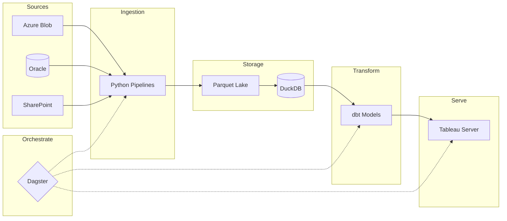

## Overview

I'm Vishal Kerai, a Senior Analyst at QVC with a background in analytics and data engineering. This portfolio documents a modern data stack I designed and built from scratch — and the thinking behind it.

### The Environment I Inherited

When I joined QVC in January 2024, the analytics infrastructure was a product of its era. The flagship reports — the ones the business relied on daily — were Excel workbooks powered by VBA macros and, in some cases, ActiveX controls for interactivity. ActiveX was sunsetted years ago and is now a security risk; those reports are actively being replaced.

The broader stack looked like this:

- **Oracle** — the transactional source database
- **Hyperion** — an OLAP layer for scheduling extracts to network drives. Support ended years ago, with stability limitations
- **Excel + Power Query** — the analytics platform. Analysts connected to Oracle via ODBC, linked to Hyperion extracts and business spreadsheets, transformed in Power Query, and built pivots
- **16GB laptops** — where it all ran, often from home over slow VPN connections

It worked. People delivered insights, built dashboards, ran the business. But there were constraints around speed, reliability, and maintainability.

### Why I Built Something Different

When I hit the limitations — Excel row limits, day-long rebuilds, no version control — I reached for what I knew: Python and SQL. Six months of exploration led me to dbt, DuckDB, and a local-first approach that worked within existing infrastructure rather than waiting for cloud approvals.

The full story is in [[journey/index|The Journey]].

### What I Built

A modern analytics platform that consolidates data from Oracle, Azure Blob Storage, and SharePoint into a unified, version-controlled data warehouse powered by DuckDB and dbt.

> [!success] Impact
> **Pipeline runtime: 1 day → 20 minutes.** What used to crash my laptop now runs reliably every morning. 100+ dbt models serve 4 international markets (UK, DE, IT, JP), with ~50 stakeholders consuming Tableau reports built on this foundation.

## Architecture at a Glance

**Sources:**
- **Oracle** — Legacy transactional database. Sales, inventory, customer data. Slow to query directly for large datasets.
- **Azure Blob** — Files dumped by data engineering. CSVs, Excel exports, and the [[parquet-lake|Parquet Lake]].
- **SharePoint** — Business-managed spreadsheets. Pricing, promotions, manual overrides.

---

## 📚 The Stack

Technologies powering the platform. [[stack/index|Browse all →]]

| Technology | Purpose |
|------------|---------|
| [[sources\|Sources]] | Where the data comes from (Oracle, Azure, SharePoint) |
| [[parquet-lake\|Parquet Lake]] | Extending the existing data lake for analyst access |
| [[duckdb\|DuckDB]] | The database that made it all possible |
| [[dbt\|dbt]] | Transformation layer (medallion architecture) |
| [[dbt-duckdb\|dbt-duckdb]] | Technical patterns and SQL reference |
| [[dagster\|Dagster]] | Orchestration and scheduling |
| [[python-pipelines\|Python Pipelines]] | Ingestion from Azure, Oracle, SharePoint |
| [[tableau\|Tableau]] | Serving data to the business |

---

## 🛤️ The Journey

How this platform evolved and what I learned. [[journey/index|Browse all →]]

| Topic | Description |
|-------|-------------|
| [[case-studies\|Case Studies]] | Real problems solved (STAR format) |
| [[challenges\|Challenges]] | Technical obstacles overcome |
| [[ai-accelerated-development\|AI-Accelerated Dev]] | How I used Claude Code |

---

## 🔧 How-To Guides

Practical patterns for common data problems. [[how-to/index|Browse all →]]

| Guide | Problem It Solves |
|-------|-------------------|
| [[hyper-api\|Automating Tableau Extracts]] | Publish data to Tableau Server without opening Desktop |
| [[transformation-layer\|Building a Transformation Layer]] | Structure transformations so you're not starting from scratch |
| [[local-large-data\|Working with Large Data Locally]] | Handle datasets that push against your laptop's RAM limits |

*These guides share what I've learned. They're based on Python/dbt, but the concepts often transfer to other tools.*

