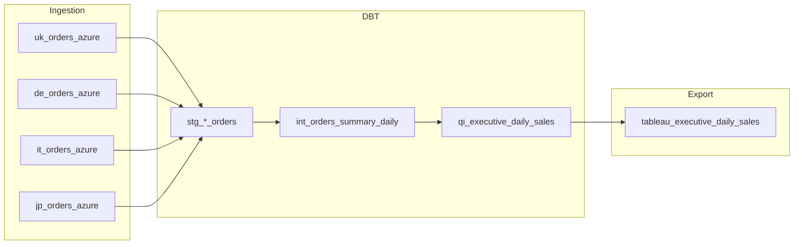

## Why Orchestration Matters

Before Dagster, we used batch files triggered by Windows Task Scheduler. It worked—until it didn't.

The problem wasn't the scripts. The problem was everything around them:

- **No visibility** — Did yesterday's job run? Did it succeed? No way to know without checking manually.
- **No logging** — When something failed, debugging meant reading through console output (if anyone saved it).
- **No alerting** — Failures were discovered when someone noticed stale data, not when they happened.
- **Manual intervention** — Someone had to log in each morning, check things were running, monitor the process.

This takes time and mental bandwidth. Automating monitoring frees up time for analytical work.

**Dagster solves all of this.** It provides automation, logging, failure visibility, and scheduling in a single code-based interface. It's not just "cron with a UI"—it's a fundamentally different way of thinking about data pipelines.

## From Batch Files to Dagster

The migration wasn't a wholesale replacement. We started by wrapping existing scripts as Dagster assets, then gradually rebuilt them properly.

**Before:**
```
task_scheduler_job.bat → python scripts/sync_azure.py → hope it worked
```

**After:**
```python
@asset(
    description="Sync UK orders from Azure to Parquet",
    group_name="azure_ingestion_orders",
    retry_policy=RetryPolicy(max_retries=5, delay=60, backoff=Backoff.EXPONENTIAL)
)
def uk_orders_azure(context: AssetExecutionContext):
    result = run_azure_sync(market="UK", folder_name="ingest_orders", days_back=30)
    context.log.info(f"Synced {result['rows_loaded']:,} rows")
    return result
```

Same underlying logic. But now we have retries, logging, dependency tracking, and visibility into every run.

## Asset-Based Architecture

Dagster thinks in **assets**, not jobs. An asset is something that should exist—a file, a table, a model. The orchestrator's job is to make sure assets are fresh.

This mindset shift matters. Instead of asking "did my script run?", we ask "is my data current?". The [[stack/index|system architecture]] flows naturally from this:



Each box is an asset. Dagster tracks dependencies automatically and only runs what's needed.

## Capabilities

### Ingestion Assets

[[python-pipelines|Python pipelines]] wrapped as Dagster assets. These sync data from Azure Blob Storage to local Parquet files.

**Single-file reference data:**
```python
@asset(group_name="azure_ingestion_reference")
def uk_products_sku(context: AssetExecutionContext):
    result = run_azure_sync(market="UK", folder_name="ingest_products_sku", force=True)
    context.log.info(f"Synced {result['rows_loaded']:,} rows")
    return result
```

**Year-partitioned order data:**
```python
@asset(group_name="azure_ingestion_orders")
def uk_orders_azure(context: AssetExecutionContext):
    # Handles: UK/raw_data/DWH/Oracle/ingest_orders/YYYY/ingest_orders_YYYYMMDD.csv
    result = run_azure_sync(market="UK", folder_name="ingest_orders", days_back=30)
    return result
```

**Budget data from SharePoint:**
```python
@asset(group_name="budget_ingestion")
def daily_sales_budget_exchange_ingest(context: AssetExecutionContext):
    # Reads Excel from SharePoint, transforms wide→long, outputs CSV
    result = run_daily_sales_ingest()
    context.log.info(f"Budget year: {result['budget_year']}, rows: {result['total_rows']:,}")
    return result
```

### DBT Integration

[[dbt|dbt models]] run through Dagster using the `@dbt_assets` decorator. A single definition expands into 100+ individual model assets:

```python
@dbt_assets(
    manifest=QVC_UK_CA_DBT_project.manifest_path,
    dagster_dbt_translator=QVCDbtTranslator(),
    op_tags={"dbt_duckdb": "true"}
)
def QVC_UK_CA_DBT_dbt_assets(context: AssetExecutionContext, dbt: DbtCliResource):
    yield from dbt.cli(["build"], context=context).stream()
```

The custom `QVCDbtTranslator` groups models by layer and market:
- `dbt_staging_uk_azure` — UK staging models from Azure sources
- `dbt_transformations_cross_market` — Multi-market business logic
- `dbt_marts_uk_commercial` — Final tables for commercial team

For selective runs, wrapper assets call specific models:

```python
@asset(
    deps=["uk_orders_azure", "uk_new_names", "daily_sales_budget_exchange_ingest"],
    op_tags={"dbt_duckdb": "true"}
)
def build_daily_sales_models(context: AssetExecutionContext):
    cmd = [sys.executable, str(dbt_script), 'run', '--select', '+qi_executive_daily_sales']
    subprocess.run(cmd, capture_output=True, text=True, check=True)
    return {"status": "success"}
```

### Tableau Exports

[[tableau|Tableau exports]] use a flag-based script approach. A single script handles the full workflow: DuckDB → Hyper file → Tableau Server.

**The script:**
```bash
python duckdb_to_tableau_server.py --tables table1 table2 --name extract_name
```

This script:
1. Connects to DuckDB and queries the specified tables
2. Exports to Parquet format
3. Converts to Tableau Hyper format
4. Publishes to Tableau Server
5. Creates a local backup

**Dagster asset wrapping the script:**
```python
@asset(
    deps=["build_daily_sales_models"],
    description="Create Tableau Hyper extract for daily sales summary",
    group_name="export"
)
def daily_sales_tableau_export(context: AssetExecutionContext):
    script_path = project_root / 'bat_file_data_refresh' / 'python' / 'create_hyper_files' / 'duckdb_to_tableau_server.py'

    cmd = [
        sys.executable,
        str(script_path),
        '--tables', 'int_orders_summary_daily',
        '--name', 'daily_sales_summary'
    ]

    result = subprocess.run(cmd, capture_output=True, text=True, check=True)
    context.log.info(f"Hyper extract created: {result.stdout}")
    return {"status": "success", "table": "int_orders_summary_daily"}
```

**Why this works:**
- The script handles all complexity (Hyper API, Tableau Server auth, file management)
- Dagster assets just specify *which* tables and *what* name
- Adding a new export means writing a simple asset with different flags
- Dependencies declared via `deps` ensure data is fresh before export

This is simpler than a factory pattern—less abstraction, easier to understand, and the command-line interface makes testing trivial.

## Scheduling

Jobs group assets for scheduled execution. Schedules define when jobs run.

| Job | Schedule | What It Does |
|-----|----------|--------------|
| `ingest_azure_qi_job` | 3:15 PM daily | Sync orders + reference data from Azure |
| `daily_sales_flow_job` | 3:45 PM daily | Full pipeline: ingest → dbt → Tableau |
| `uk_morning_refresh_with_backup` | 7:15 AM daily | Orderline refresh + backup |
| `ingest_scv_job` | 4:00 PM (1st-3rd monthly) | Single Customer View data |

**Example job definition:**
```python
daily_sales_flow_job = define_asset_job(
    name="daily_sales_flow",
    selection=AssetSelection.keys(
        "uk_orders_azure", "it_orders_azure", "de_orders_azure", "jp_orders_azure",
        "uk_new_names", "daily_sales_budget_exchange_ingest",
        "build_daily_sales_models", "tableau_executive_daily_sales"
    ),
    description="Complete end-to-end daily sales flow",
)
```

**Example schedule:**
```python
ScheduleDefinition(
    job=daily_sales_flow_job,
    cron_schedule="45 15 * * *",  # 3:45 PM daily
    execution_timezone="Europe/London",
)
```

## Operational Reality

### Dev Deployment

The current setup runs as a **dev deployment**—Dagster's development server running in a command prompt on a Windows desktop in the office.

This means:
- No clustering or high availability
- Server restarts required after Windows updates
- Single point of failure (the desktop machine)

It's not production-grade infrastructure. But it works. The machine runs 24/7, and when it goes down, we restart the orchestration server. The alternative—manual daily runs—is worse.

### Concurrency Control

[[duckdb|DuckDB]] is single-writer. Two concurrent writes cause lock errors. Dagster handles this with tag-based concurrency limits:

```yaml
# dagster.yaml
run_coordinator:
  config:
    tag_concurrency_limits:
      - key: "dbt_duckdb"
        limit: 1
```

Assets tagged with `op_tags={"dbt_duckdb": "true"}` queue instead of running in parallel. See [[challenges#Challenge 1 DuckDB Concurrency in Orchestration|the concurrency challenge]] for background.

### Retry Policies

Critical assets have retry policies with exponential backoff:

```python
retry_policy=RetryPolicy(max_retries=5, delay=60, backoff=Backoff.EXPONENTIAL)
# Retries at: 60s, 120s, 240s, 480s, 960s
```

Transient failures (network blips, temporary locks) resolve themselves. Persistent failures surface in the UI for investigation.

## What This Enables

With Dagster in place:

- **Data is fresh by 7:30 AM** — Commercial team has what they need when they arrive
- **Failures are visible** — The UI shows exactly what failed and why
- **Adding pipelines is trivial** — Config-driven patterns mean new exports in minutes
- **Dependencies are explicit** — No more "did you run the other script first?"
- **History is preserved** — Every run logged, every output tracked

The mental overhead of "is the data ready?" is gone. That's the real value.

## Related

- [[stack/index|The Stack]] — How Dagster fits into the overall system
- [[python-pipelines|Python Pipelines]] — The ingestion scripts Dagster orchestrates
- [[dbt|dbt]] — Transformation layer integrated via `@dbt_assets`
- [[duckdb|DuckDB]] — Database with concurrency constraints Dagster manages
- [[tableau|Tableau]] — Export destination via flag-based script
- [[challenges#Challenge 1 DuckDB Concurrency in Orchestration|DuckDB Concurrency Challenge]] — Why we need tag-based limits
- [[case-studies#Case Study 1 Multi-Market Daily Sales Pipeline|Daily Sales Pipeline Case Study]] — End-to-end orchestration example
