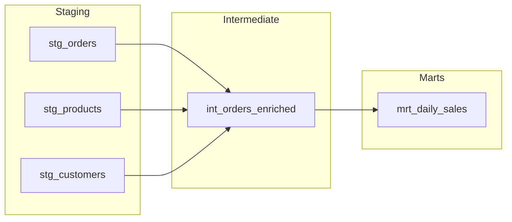

## What dbt Brings

dbt (data build tool) is the transformation layer of the MDS. It turns raw data into analytics-ready datasets through version-controlled SQL.

> [!success] Impact
> 100+ models across 4 markets, all version-controlled and testable. What was once scattered SQL files and tribal knowledge is now a documented, maintainable codebase.

**Why dbt matters:**
- **Version control** - Every transformation is tracked in Git
- **Modularity** - Models build on each other with explicit dependencies
- **Testing** - Data quality checks run automatically
- **Documentation** - Schema and descriptions live with the code
- **Collaboration** - Multiple people can work on the same codebase

Before dbt, transformations lived in scattered SQL files, undocumented Python scripts, and tribal knowledge. Now they're in one place, testable, and self-documenting.

## The Medallion Architecture

Models are organised in layers, each with a clear purpose:

```
dbt/models/
├── a_staging/           # Bronze: Raw → Standardised
│   ├── azure/           # Data from Azure Blob
│   ├── oracle/          # Data from Oracle
│   └── business_created/# Manual reference data
│
├── b_intermediate/      # Silver: Standardised → Business Logic
│   ├── products/        # Cross-market product data
│   ├── customers/       # Segmentation, cohorts
│   └── legacy/          # Market-specific transforms
│       ├── uk/
│       ├── de/
│       ├── it/
│       └── jp/
│
└── c_marts/             # Gold: Business Logic → Final Datasets
    ├── commercial/      # Sales, brand analysis
    ├── operational/     # Warehouse metrics
    └── shared/          # Cross-team reports
```

### Staging (a_staging)

**Purpose**: Standardise raw data into a consistent format.

- Rename columns to snake_case
- Cast data types explicitly
- Add market identifier
- No business logic - just cleaning

```sql
-- stg_uk_orders.sql
SELECT
    'UK' AS market,
    CAST(order_no AS VARCHAR) AS order_no,
    CAST(order_date AS DATE) AS order_date,
    CAST(member_no AS VARCHAR) AS member_no,
    CAST(revenue AS DECIMAL(10,2)) AS revenue
FROM {{ source('qi_data_lake', 'uk_ingest_orders') }}
```

### Intermediate (b_intermediate)

**Purpose**: Apply business logic and combine data.

- Joins across sources
- Calculations and derivations
- Business rules applied
- Still relatively granular

```sql
-- int_orders_enriched.sql
SELECT
    o.*,
    p.brand,
    p.category,
    c.customer_segment,
    o.revenue * fx.rate AS revenue_gbp
FROM {{ ref('stg_uk_orders') }} o
LEFT JOIN {{ ref('stg_products') }} p ON o.sku = p.sku
LEFT JOIN {{ ref('stg_customers') }} c ON o.member_no = c.member_no
LEFT JOIN {{ ref('stg_exchange_rates') }} fx ON o.order_date = fx.date
```

### Marts (c_marts)

**Purpose**: Final datasets optimised for consumption.

- Aggregated to the grain needed
- Pre-calculated metrics
- Ready for dashboards and reports
- Persisted as tables for performance

```sql
-- mrt_daily_sales.sql
SELECT
    order_date,
    market,
    brand,
    SUM(revenue_gbp) AS total_revenue,
    COUNT(DISTINCT member_no) AS unique_customers,
    COUNT(*) AS order_count
FROM {{ ref('int_orders_enriched') }}
GROUP BY order_date, market, brand
```

## How Models Connect

dbt builds a dependency graph using `ref()`:

```sql
-- This model depends on stg_orders
SELECT * FROM {{ ref('stg_orders') }}
```

When you run a model, dbt automatically runs its dependencies first. The graph looks like:



## Testing

dbt tests validate data quality:

```yaml
# schema.yml
models:
  - name: stg_uk_orders
    columns:
      - name: order_no
        tests:
          - not_null
          - unique
      - name: order_date
        tests:
          - not_null
      - name: revenue
        tests:
          - not_null
          - dbt_utils.accepted_range:
              min_value: 0
              max_value: 100000
```

Tests run after models build. Failures alert us to data quality issues before they reach dashboards.

**Common test patterns:**
- `unique` - No duplicate keys
- `not_null` - Required fields are populated
- `accepted_values` - Enums match expected values
- `relationships` - Foreign keys exist in parent table

## Documentation

Every model and column can be documented inline:

```yaml
# schema.yml
models:
  - name: mrt_daily_sales
    description: "Daily sales aggregated by market and brand. Refreshed daily at 7:30 AM."
    columns:
      - name: total_revenue
        description: "Sum of revenue in GBP, converted at daily exchange rate"
      - name: unique_customers
        description: "Count of distinct member_no values"
```

Generate documentation site:
```bash
dbt docs generate
dbt docs serve
```

This creates a browsable site with lineage graphs, column descriptions, and test results.

## Multi-Market Support

The MDS serves 4 markets: UK, Germany, Italy, Japan. Models handle this through:

**1. Market-specific staging models:**
```
stg_uk_orders.sql
stg_de_orders.sql
stg_it_orders.sql
stg_jp_orders.sql
```

**2. Union models for cross-market analysis:**
```sql
-- stg_all_orders.sql
SELECT * FROM {{ ref('stg_uk_orders') }}
UNION ALL
SELECT * FROM {{ ref('stg_de_orders') }}
UNION ALL
SELECT * FROM {{ ref('stg_it_orders') }}
UNION ALL
SELECT * FROM {{ ref('stg_jp_orders') }}
```

**3. Market column in every model:**
```sql
SELECT
    'UK' AS market,
    order_no,
    ...
```

See [[dbt-duckdb#Multi-Market Identity]] for the critical rule about composite keys.

## Running dbt

```bash
# Run all models
dbt run

# Run specific model and its dependencies
dbt run --select +mrt_daily_sales

# Run model and everything downstream
dbt run --select stg_orders+

# Run tests
dbt test

# Generate docs
dbt docs generate && dbt docs serve
```

In the MDS, dbt runs are orchestrated by [[dagster|Dagster]], not manually.

## Related

- [[dbt-duckdb]] — Technical reference for dbt on DuckDB
- [[duckdb]] — Why DuckDB is the foundation
- [[dagster]] — How dbt runs are orchestrated
- [[stack/index|The Stack]] — Where dbt fits in the overall system
- [[case-studies#Case Study 4 Customer Segmentation Rebuild|Customer Segmentation rebuild]] — dbt replacing manual Python
