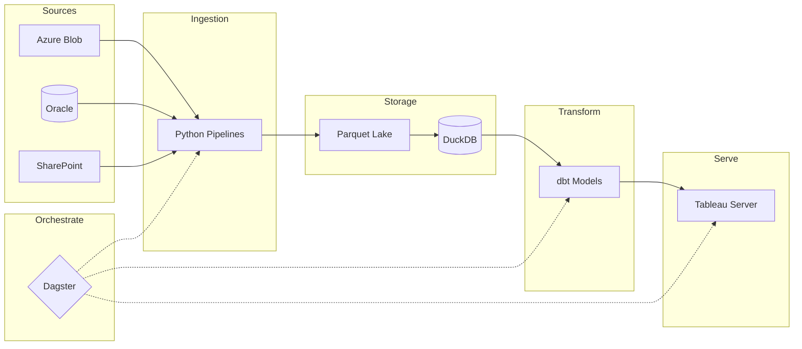

## Overview

The Modern Data Stack (MDS) is a unified analytics platform that consolidates data from multiple source systems into a single queryable database, transforms it through version-controlled SQL, and serves it to business tools — all orchestrated automatically.

> [!success] What This Achieves
> Automated daily pipelines across 4 markets. Fresh data lands in Tableau by 7:30 AM without manual intervention. 100+ dbt models, version-controlled and documented.

Every tool was chosen because it worked within our constraints:

| Constraint | Solution |
|------------|----------|
| No cloud approval | DuckDB runs locally |
| No budget | All tools are free/open source |
| Corporate network blocks packages | DuckDB-native SQL, no dbt packages |
| Read-only Oracle | Parquet files as intermediate storage |
| Single machine | Dagster concurrency controls |

---

## Architecture



---

## Data Sources

Data flows in from four source systems. See [[sources]] for details on each.

- **Oracle** — legacy transactional database (sales, inventory, customers)
- **Azure Blob** — the QI Data Lake (CSVs from legacy systems)
- **Azure Synapse** — operational data warehouse
- **Network Drives** — business-managed spreadsheets (budgets, TSV plans)

The official data lake had issues that made it unusable for interactive analysis. See [[parquet-lake]] for how I built a local mirror.

---

## DuckDB — The Foundation

[[duckdb|DuckDB]] is the analytical database at the centre of everything. All data lives here after ingestion, and all transformations happen here.

**Why DuckDB:**
- Runs locally on a single machine — no server infrastructure
- Reads Parquet files directly — no separate loading step
- Fast analytical queries — columnar storage, vectorised execution
- Single file database — easy to backup, move, or restore

The database file is built locally on an SSD for speed, while source Parquet files live on network drives. See [[challenges#Challenge 7: Network vs Local Build Strategy|the build strategy challenge]] for how I optimised this.

---

## dbt — The Transformation Layer

[[dbt]] handles all SQL transformations. Every piece of business logic lives here as version-controlled SQL.

**Medallion architecture:**

```
dbt/models/
├── a_staging/           # Raw → Standardised
│   ├── azure/
│   ├── oracle/
│   └── business_created/
│
├── b_intermediate/      # Standardised → Business Logic
│   ├── products/
│   ├── customers/
│   └── legacy/
│       ├── uk/
│       ├── de/
│       ├── it/
│       └── jp/
│
└── c_marts/             # Business Logic → Final Datasets
    ├── commercial/
    ├── operational/
    └── shared/
```

**Materialisation strategy:**
- Staging & Intermediate: Views (computed on query, no storage)
- Marts: Tables (persisted, fast to query)

See [[dbt-duckdb]] for technical patterns and SQL reference.

---

## Dagster — The Orchestrator

[[dagster]] coordinates everything. It knows what depends on what and runs things in the right order.

**Asset-based thinking:** Instead of "jobs that run scripts", Dagster thinks about "assets that need to exist" — a Parquet file, a dbt model, a Tableau extract. It tracks which are stale and what needs to run.

**Key daily jobs:**

| Job | What it does |
|-----|--------------|
| `daily_sales_flow` | Ingests orders → builds daily sales model → publishes to Tableau |
| `uk_morning_refresh_with_backup` | Refreshes orderline → builds brand tool → backs up database |
| `ingest_azure_qi` | Syncs reference data from Azure across markets |

**Concurrency control:** DuckDB only allows one writer at a time. Dagster handles this with tag-based limits — jobs tagged `dbt_duckdb` run one at a time.

---

## Python Pipelines — The Ingestion Layer

Custom [[python-pipelines|Python pipelines]] handle getting data from source systems into Parquet files.

**Main patterns:**
1. **Azure Blob → Parquet**: Downloads CSVs, converts to Parquet with proper typing
2. **SharePoint → Parquet**: Fetches Excel files, normalises to Parquet
3. **State tracking**: Each pipeline remembers what it's processed, only fetching new files

**Why custom pipelines:** Corporate network blocks most packages. Sources have quirks (European CSV dialects, encoding issues). Simpler to maintain code we fully understand.

---

## Tableau — The Serving Layer

[[tableau]] is how data reaches the business. Dagster publishes extracts to Tableau Server automatically.

**The pattern:**
- dbt builds mart tables
- Python script exports to Hyper format
- Dagster publishes to Tableau Server
- Business users see fresh data in their dashboards

---

## The Daily Flow

What happens automatically every day:

**7:15 AM** — UK daily refresh
- Orderline model rebuilt with overnight data
- Brand tool refreshed
- Database backed up
- Tableau extracts updated
By the time analysts arrive, fresh data is waiting.

**3:15 PM** — Azure QI data lake ingestion
- Orders for all 4 markets synced
- Reference data refreshed

**3:45 PM** — QI Daily sales pipeline
- Budget and exchange rates fetched
- Executive daily sales model built
- Published to Tableau Server


---

## Design Principles

**Configuration over code** — Adding a new Tableau export is 5 lines of config, not 50 lines of Python.

**Explicit dependencies** — Every asset declares what it depends on. No hidden dependencies, no mystery failures.

**Fail-safe operations** — Pipelines backup before overwriting. If a write fails, the previous version is restored.

**Multi-market by default** — Every model considers that data comes from 4 markets. Customer IDs are always paired with market codes.

---

## Related

- [[case-studies]] — Real-world examples of this architecture in action
- [[challenges]] — Problems solved while building this system
