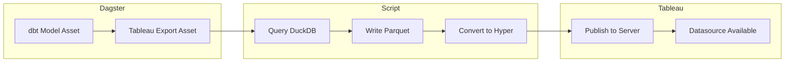

## Why This Matters

A data platform is only as valuable as its ability to deliver insights to decision-makers. [[duckdb|DuckDB]] and [[dbt|dbt]] handle storage and transformation, but analysts work in Tableau. This page covers how the MDS publishes data to Tableau Server automatically.

> [!success] Impact
> Fresh data in Tableau by 7:30 AM, every day, without manual intervention. Adding a new export takes 5 lines of config, not 50 lines of code.

## The Challenge

Building transformation pipelines is one thing. Getting that data into the hands of analysts and business users in a reliable, automated way is another challenge entirely.

**Questions we had to answer:**

- How do we publish DuckDB tables to Tableau Server automatically?
- How do we manage dependencies between dbt models and Tableau extracts?
- How do we make adding new exports trivial instead of a development project?

## Architecture: Flag-Based Script

### The Problem

Each Tableau export started as a separate [[dagster|Dagster]] asset with ~50 lines of boilerplate:

```python
@asset(deps=["run_int_orderline_attribute"])
def int_orderline_attribute_hyper(context):
    # Connect to DuckDB
    # Query the table
    # Export to Parquet
    # Convert to Hyper
    # Authenticate to Tableau Server
    # Publish the extract
    # Handle errors, logging, retries...
    # ~50 lines of nearly identical code
```

Adding 10 new exports meant writing 500 lines of nearly identical code. Copy-paste errors were common.

### The Solution

A single script that handles the entire workflow, controlled by command-line flags:

```bash
python duckdb_to_tableau_server.py --tables table1 table2 --name extract_name
```

The script (`duckdb_to_tableau_server.py`) handles all complexity:
1. Connects to DuckDB and queries specified tables
2. Exports to Parquet format
3. Converts to Tableau Hyper format using the Hyper API
4. Authenticates to Tableau Server
5. Publishes the extract
6. Creates local backup copies

Dagster assets become simple wrappers:

```python
@asset(
    deps=["build_daily_sales_models"],
    description="Export daily sales to Tableau Server",
    group_name="export"
)
def daily_sales_tableau_export(context):
    cmd = [
        sys.executable, str(script_path),
        '--tables', 'int_orders_summary_daily',
        '--name', 'daily_sales_summary'
    ]
    result = subprocess.run(cmd, capture_output=True, text=True, check=True)
    context.log.info(f"Published: {result.stdout}")
    return {"status": "success"}
```

### Why This Design?

| Consideration | Outcome |
|---------------|---------|
| **Simplicity** | One script, one responsibility |
| **Testability** | Run from command line without Dagster |
| **Flexibility** | Any table combination, any extract name |
| **Debuggability** | Errors appear in stdout, easy to reproduce |

## Data Flow: DuckDB to Tableau



## Active Exports

### Commercial Team

| Export | Source Table | Purpose |
|--------|--------------|---------|
| Orderline Attributes | `int_orderline_attribute` | Main commercial analysis dataset with product attributes |
| Daily Reactivants | `mrt_daily_reactivants` | Customer reactivation tracking |
| Executive Daily Sales | `qi_executive_daily_sales` | C-level performance dashboard across all markets |

### Operational Team

| Export | Source Table | Purpose |
|--------|--------------|---------|
| Basket PnP | `mrt_basket_PnP_data` | Pick and pack operations data |

### Multi-Market

| Export | Source Table | Purpose |
|--------|--------------|---------|
| Orders Summary Daily | `int_orders_summary_daily` | Cross-market daily aggregates (UK, DE, IT, JP) |

## Scheduling Strategy

Exports are timed to ensure data is ready when analysts arrive:

| Schedule | Time | Rationale |
|----------|------|-----------|
| Morning refresh | 7:15 AM | Data ready before commercial team arrives |
| Daily sales flow | 3:45 PM | After Azure data lands (~3:15 PM), ready for next morning |

See [[dagster#Scheduling|Dagster scheduling]] for the full schedule configuration.

## Lessons Learned

### What Worked Well

- **Flag-based script is testable** — Can run `python script.py --tables X --name Y` directly without spinning up Dagster
- **Single source of truth** — All publishing logic in one script, no drift between assets
- **Explicit dependencies** — Dagster `deps` parameter ensures dbt models complete before export attempts

### What We'd Do Differently

- **Earlier investment in notifications** — Added ntfy alerts late; would build in from the start
- **Hyper file versioning** — Currently overwrites; could keep dated backups for rollback

## Related

- [[dagster#Tableau Exports|Dagster Tableau Exports]] — How exports are orchestrated
- [[duckdb|DuckDB]] — Source database for all exports
- [[dbt|dbt]] — Transformation layer producing the tables we export
- [[case-studies#Case Study 2 Flag-Based Tableau Exports|Flag-Based Exports Case Study]] — The full story of this pattern
